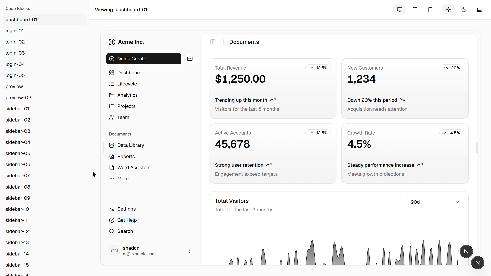

# shadcn-designer

<div align="center">
<kbd>
   
</kbd>
</div>

\
A **design-system storybook** built as a codebase template. Drop in your
reference designs, build full-page UI blocks with [shadcn/ui] components, and
preview them side-by-side in a live Next.js viewer—all inside a single monorepo.

Think of it as a giant storybook for design systems, but instead of a third-party
tool, it's a forkable codebase that integrates directly with shadcn.

## How it works

```
┌─────────────────────────────────────────────────────────┐
│  design/               Your reference designs go here   │
│  (prototypes, specs,   ─────────────────────────────►   │
│   brand assets)        Compare against the viewer       │
├─────────────────────────────────────────────────────────┤
│  packages/ui/          shadcn/ui component library      │
│  (buttons, sidebar,    ─────────────────────────────►   │
│   dialogs, etc.)       Primitives used by blocks        │
├─────────────────────────────────────────────────────────┤
│  apps/web/             Block viewer (Next.js)           │
│  (app/blocks/*)        Browse & preview full-page       │
│                        compositions in an iframe        │
└─────────────────────────────────────────────────────────┘
```

1. **`design/`** — Where you put your reference design files: prototype HTML
   exports, design system specs, brand assets, handoff docs. Git-ignored by
   default so you can drop in proprietary assets without worrying about commits.
2. **`packages/ui/`** — A shared component library where shadcn/ui primitives
   are installed. All blocks and the viewer itself import from here.
3. **`apps/web/`** — A Next.js app that serves as the viewer. It auto-discovers
   block directories under `app/blocks/`, lists them in a sidebar, and renders
   each one in an isolated iframe with responsive preview controls.

## Monorepo structure

```
├── apps/
│   └── web/                    # Next.js block viewer
│       ├── app/
│       │   ├── page.tsx        # Viewer entry point (discovers blocks via fs)
│       │   └── blocks/         # Each subdirectory is a full-page block
│       │       ├── dashboard-01/
│       │       ├── login-01/
│       │       ├── sidebar-01/
│       │       └── ...
│       └── components/
│           ├── block-viewer/   # Sidebar, toolbar, iframe preview
│           └── theme-provider.tsx
├── packages/
│   ├── ui/                     # shadcn/ui components (@workspace/ui)
│   ├── eslint-config/          # Shared ESLint config
│   └── typescript-config/      # Shared TypeScript config
├── design/                     # Your design reference files
├── turbo.json                  # Turborepo task pipeline
└── pnpm-workspace.yaml
```

## Getting started

### Prerequisites

- [Node.js](https://nodejs.org/) ≥ 20
- [pnpm](https://pnpm.io/) ≥ 10

### Setup

```bash
# Install dependencies
pnpm install

# Start the dev server
pnpm dev
```

The viewer will be available at `http://localhost:3000`.

### Adding shadcn components

```bash
pnpm dlx shadcn@latest add button -c apps/web
```

This installs the component into `packages/ui/src/components/` so it's available
to the entire monorepo.

### Using components

Import from the `@workspace/ui` package alias:

```tsx
import { Button } from "@workspace/ui/components/button"
import { cn } from "@workspace/ui/lib/utils"
```

### Creating a new block

1. Create a directory under `apps/web/app/blocks/` (e.g., `my-page-01/`).
2. Add a `page.tsx` that composes a full-page layout using components from
   `@workspace/ui`.
3. Restart or refresh the viewer—the new block appears in the sidebar
   automatically.

Each block is a standalone Next.js route rendered in an iframe, so it gets full
layout isolation from the viewer.

## Adding your design files

Drop your design reference materials into the `design/` folder:

- **Design specs** (`DESIGN.md`, `brand-spec.md`) — colors, typography, spacing
- **Prototype HTML** — static exports from Figma, Open Design, or similar tools
- **Handoff docs** (`DESIGN-HANDOFF.md`) — implementation guidance
- **Brand assets** — fonts, icons, logos

Everything in `design/` is git-ignored by default. See
[design/README.md](./design/README.md) for details on tracking specific files.

## Workflow

1. Place your design references in `design/`.
2. Open the prototype HTML files in a browser to see the target UI.
3. Build blocks under `apps/web/app/blocks/` using `packages/ui/` components.
4. Run `pnpm dev` and use the viewer to compare your blocks against the
   prototypes.
5. Iterate until the blocks match the design.

## Scripts

Run from the monorepo root:

| Command | Description |
|---|---|
| `pnpm dev` | Start the Next.js dev server |
| `pnpm build` | Production build |
| `pnpm lint` | Run ESLint across all workspaces |
| `pnpm typecheck` | Run TypeScript type checking |
| `pnpm format` | Format code with Prettier |

## Contributing

See [CONTRIBUTING.md](./CONTRIBUTING.md) for codebase architecture details,
coding conventions, and documentation guidelines.

[shadcn/ui]: https://ui.shadcn.com
